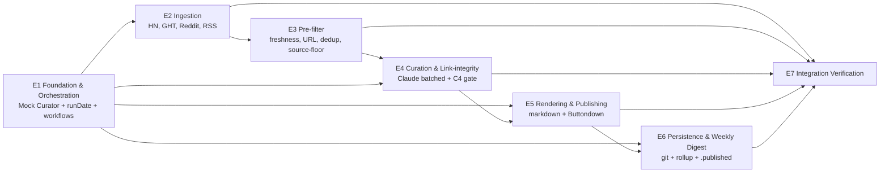

# AI Builder Pulse — Phase 3 Decomposition Synthesis

**Prepared:** 2026-04-18
**Inputs:** 6 parallel Phase-3 subagents (bounded-context mapper, dependency analyst, scope sizer, interface designer, STPA control analyst, structural-semantic gap analyst)
**Spec:** `docs/specs/ai-builder-pulse.md` (R1–R14 applied)
**Advisory brief:** `docs/specs/ai-builder-pulse-advisory-brief.md`

---

## 1. Final Epic Structure — 6 Domain Epics + 1 Integration Verification

All six subagents converged on the spec's Section 8 target. Cognitive-load budget (Miller 7±2) is satisfied for every epic. DDD boundaries, dependency graph, and STPA control hierarchy agree.

| # | Epic | Concepts | Volatility | Owner-team archetype |
|---|---|---|---|---|
| E1 | **Foundation & Orchestration** | 7 | MODERATE | Platform / Stream-aligned |
| E2 | **Ingestion** | 9 (at ceiling, cohesive) | HIGH | Stream-aligned |
| E3 | **Pre-filter** | 5 | HIGH (tuning) | Stream-aligned |
| E4 | **Curation & Link-integrity** | 7 | HIGH (prompt + invariant) | Complicated-subsystem |
| E5 | **Rendering & Publishing** | 7 | LOW | Stream-aligned |
| E6 | **Persistence & Weekly Digest** | 6 | LOW | Stream-aligned |
| E7 | **Integration Verification** | 7 | LOW | Enabling |

**Why not fold Pre-filter into Ingestion?** Scope sizer flagged that Ingestion is already at the 9-concept ceiling; merging produces a 14-concept epic. Keeping Pre-filter as its own epic preserves budget and keeps freshness/dedup/source-floor testable in isolation. Semantic analyst agreed with this structural nesting, but structural cohesion preferences win here because cognitive load is the binding constraint.

---

## 2. Dependency Graph

**Processing order (topological layers):**
| Layer | Epics | Parallelizable |
|---|---|---|
| L1 | E1 Foundation & Orchestration (incl. Mock Curator) | — |
| L2 | E2 Ingestion, E5 Rendering & Publishing, E6 Persistence (partial, archive mechanics) | Yes — all three run against Mock Curator |
| L3 | E3 Pre-filter | After E2 contract C2 is stable |
| L4 | E4 Curation & Link-integrity | Critical path; replaces Mock Curator |
| L5 | E6 Persistence & Weekly Digest (complete: weekly rollup) | After real ScoredItems exist |
| L6 | E7 Integration Verification | After all others |

**Critical path:** E1 → E2 → E3 → E4 → E5 → E6 → E7. E4 is the longest-tail epic (prompt engineering + E-05 invariant enforcement); Mock Curator unlocks L2/L5 parallel development.

---

## 3. Per-Epic Scope, EARS Subset, Contracts, Assumptions

### E1 — Foundation & Orchestration
**Scope in:** TS project scaffold (pnpm + tsx + vitest + Zod + @anthropic-ai/sdk), Orchestrator entry point with immutable `runDate` derivation (UTC), C8 contract, three GHA workflows (daily, weekly, keepalive), secrets plumbing, E-06 backfill logic, **Mock Curator pass-through** that satisfies C3 with fabricated but E-05-valid output.
**Scope out:** any real collector, real Claude call, real Buttondown call, real git commit of issue artifacts (keepalive only).
**EARS:** U-07, U-08, U-09, U-11, E-01 (shell), E-03, E-04, E-06, S-03 (reads sentinel only), O-02 (DRY_RUN gate).
**Owns contracts:** C8 (cron entry + runDate), C7 (reader side — Orchestrator reads `.published` at startup).
**Assumptions that must hold:** GHA cron fires approximately on schedule; `new Date().toISOString().slice(0,10)` returns canonical UTC date; pnpm is available in CI.
**Fitness function:** Unit test proves `runDate` stable across stages in one process; GHA daily workflow dispatches and exits 0 with Mock Curator E2E on fixture data.

### E2 — Ingestion
**Scope in:** All four source collectors (HN Algolia, GitHub Trending scrape, Reddit OAuth + `.json` fallback, RSS feedparser), C1 interface contract, per-collector 60s timeout enforcement via `AbortSignal`, O-06 redirect-hop resolution (≤3 hops, canonical URL → `url`, original → `sourceUrl`), closed per-source Zod `metadata` schemas (U-01 / R8), Twitter/X stubbed behind O-01 env flag.
**Scope out:** freshness gating, dedup, source-floor check (all in E3).
**EARS:** U-01, U-02 (RawItem only), S-04, O-01, O-06.
**Owns contracts:** C1 Collector, C2 RawItem schema (including per-source `metadata` variants).
**Assumptions:** HN Algolia stays free & no-auth; GitHub Trending HTML stays scrapable; Reddit app approval arrives in time or `.json` fallback remains open; RSS feeds produce valid Atom/RSS.
**Fitness function:** Each collector returns ≥1 item from a recorded fixture run; per-collector timeout test passes; redirect-hop test passes; per-source metadata schema-validated.

### E3 — Pre-filter
**Scope in:** Freshness gate (`runDate - 24h`), URL-shape validation (Un-02: no bare domain, no GitHub user-profile, scheme-valid), normalized-URL dedup (strip UTM, lowercase host, canonical trailing slash, post-redirect), S-05 minimum-source-diversity floor (default N=2).
**Scope out:** collector internals, Claude call.
**EARS:** U-03, U-04, U-10 (partial — sourceSummary construction begins here), Un-02, Un-03, S-01, S-05.
**Owns contracts:** none new; consumes C2, produces C2 (filtered).
**Assumptions:** URL normalizer is a single shared pure function reused by link-integrity (C4). `publishedAt` is always UTC ISO 8601 in RawItem.
**Fitness function:** Property test — idempotent re-application of pre-filter is a no-op; duplicate-URL fixture produces exactly one RawItem; S-05 violation fails loudly.

### E4 — Curation & Link-integrity
**Scope in:** Claude `messages.create` with structured output (anthropic SDK), chunk-merge fallback when count > `CURATOR_CHUNK_THRESHOLD` (O-05), E-05 post-parse count-invariant enforcement, Zod ScoredItem validation, prompt-file as versioned artifact (`src/curator/prompt.ts` with stable `SYSTEM_PROMPT`), token-cost logging, link-integrity predicate (C4: `verifyLinkIntegrity(scored, raw, allowlistPatterns): Result`), retry-on-invalid-JSON up to 3 attempts.
**Scope out:** markdown rendering, Buttondown call.
**EARS:** U-05, U-08, E-05, Un-01, Un-05, O-03, O-04, O-05.
**Owns contracts:** C3 ScoredItem schema, C4 link-integrity predicate.
**Assumptions:** Claude structured outputs are reliable (<3 retries normally); Claude returns ALL items with `keep: boolean` (never filters itself); `relevanceScore` is float [0.0, 1.0]; `description` is plain text 100–300 chars without markdown.
**Fitness function:** E-05 test — given 50 RawItems, Curator returns 50 ScoredItems (count-stable across keep flags); chunk-merge test preserves invariant; Un-01 passes for legit output and fails for a planted fabricated URL.

### E5 — Rendering & Publishing
**Scope in:** Markdown renderer (group by category, sort by relevance within category), template-URL allowlist (unsubscribe, Buttondown archive, newsletter site) passed to C4, `{subject, body}` C5 output, S-02 empty-issue guard (skip when count < `minItemsToPublish`), Buttondown `POST /v1/emails` adapter with tenacity-style retry + backoff, DRY_RUN (O-02) bypass of POST and C7 sentinel check, S-03 sentinel-based idempotency.
**Scope out:** git commit, weekly rollup.
**EARS:** U-05 (output ordering), E-04 (HTTP retry exhaustion), Un-01 (Renderer side — emits only allowlisted static URLs), S-02, S-03, O-02, O-03, O-04.
**Owns contracts:** C5 rendered markdown, template-URL allowlist constant (consumed by C4).
**Assumptions:** Buttondown accepts markdown natively; response JSON contains an id field usable for delivery verification; subject-line ≤80 chars renders consistently.
**Fitness function:** Golden-file test for markdown output; empty-issue test skips publish with recorded reason; DRY_RUN test produces identical body but no HTTP call.

### E6 — Persistence & Weekly Digest
**Scope in:** Archivist (write `issues/{runDate}/issue.md`, `items.json` with `sourceSummary`, `.published` sentinel atomically after Buttondown 2xx), gitleaks (or trufflehog) scan step in workflow YAML between commit and push (Un-07), E-02 weekly rollup tolerant to <7 available days, U-11 retention policy documentation, C6 archive convention, concurrency-guard on daily workflow (`group: daily-publish, cancel-in-progress: false`).
**Scope out:** Buttondown POST itself, rendering.
**EARS:** U-06, U-10, U-11, E-02, Un-04, Un-06, Un-07.
**Owns contracts:** C6 archive path convention, C7 `.published` sentinel (writer side — Archivist writes only after Buttondown ACK).
**Assumptions:** GitHub Actions `GITHUB_TOKEN` has write permissions; git push is atomic per commit; gitleaks action is available and configured.
**Fitness function:** After a successful end-to-end fixture run, `issues/{runDate}/{issue.md,items.json,.published}` all exist and are committed+pushed; Un-06 scenario (simulated push failure) is recoverable on next run via E-06.

### E7 — Integration Verification
**Scope in:** Cross-epic contract tests, E2E fixture run (nominal ~400 HN + 30 trending + 50 Reddit + 20 RSS → ~25-40 ScoredItems), failure-injection matrix covering all 20 scenarios in spec Table 4. MEDIUM scope level (behavioral + data-lifecycle contracts; no composition contracts remain post-R1).
**Depends on:** All of E1-E6.
**Contracts under test (from Section 6 of spec):**

| Contract | From | To | Type | Test approach |
|---|---|---|---|---|
| C1 Collector | E2 | E1 (Orchestrator) | Behavioral | Per-source fixture + timeout injection; S-05 floor test |
| C2 RawItem schema | E2 | E3, E4 | Data | Zod round-trip + per-source metadata variant validation |
| C3 ScoredItem schema | E4 | E5, E6 | Data | Zod + E-05 count-invariant test with mocked Claude |
| C4 Link-integrity predicate | E4 | E1 (gate) | Behavioral | Planted fabricated URL fails; legit passes; allowlist tested |
| C5 Rendered markdown | E5 | E6, Buttondown | Data | Golden-file comparison; DRY_RUN diff |
| C6 Archive path | E6 | Weekly Rollup | Data | File-existence after E2E run; mis-shaped path detection |
| C7 `.published` sentinel | E6 (write) | E1 (read) | Data (lifecycle) | Idempotency test (S-03); Un-06 divergence + E-06 backfill test |
| C8 Cron entry + runDate | E1 | all | Behavioral | UTC-date derivation test; day-boundary clock-skew test |

**IV test scenarios (must cover):**
1. E-05 Claude count mismatch → reject, retry, fail
2. Collector timeout race (AbortSignal fires, late response dropped)
3. S-05 minSources=1 → E-04, no publish
4. Un-06 divergence + E-06 backfill next run
5. E-06 + DRY_RUN interaction (no sentinel write, no push)
6. Weekly digest with missing days (E-02 annotates)
7. Un-01 + Renderer allowlist (template URLs pass; planted fabricated URL fails)
8. Secret in `metadata` → gitleaks blocks push
9. `runDate` at 23:58 UTC boundary (no off-by-one)
10. Concurrency edge — two runs fire same `runDate` (second exits via S-03 after first's push)

**Fitness function:** All IV scenarios pass in CI on the `integration-verify.yml` workflow.

---

## 4. Top Integration Risks (from STPA + Interface Design)

| # | Risk | Severity | Where mitigated |
|---|---|---|---|
| R-1 | Un-06 divergence — publish succeeds, git fails, next run re-publishes | CRITICAL | E6 (atomic `.published` only after Buttondown 2xx), E1 (E-06 backfill at startup), E7 (IV scenario 4) |
| R-2 | E-05 count-invariant misinterpreted — Curator returns kept-only → silent thin issue | CRITICAL | E4 prompt + Zod post-parse validation, E7 (IV scenario 1) |
| R-3 | S-05 minSources floor evaluated AFTER Curator fires — sunk cost | HIGH | E3 enforces floor pre-Curator, E1 orchestrates gate ordering, E7 (IV scenario 3) |
| R-4 | Per-source C1/C2 divergence — metadata shape varies; dedup + link-integrity produce different answers | HIGH | E2 closed per-source Zod schemas; shared URL normalizer used by E3 and E4; E7 tests with multi-source fixture |
| R-5 | `.published` sentinel concurrency — two simultaneous runs both think no publish happened | MEDIUM | E6 workflow `concurrency` constraint; optional local `.publishing-lock`; E7 (IV scenario 10) |
| R-6 | `runDate` non-UTC → off-by-one at day boundary | MEDIUM | E1 UTC-constant derivation + unit test; E7 (IV scenario 9) |
| R-7 | Secret leakage via unbounded `metadata` | HIGH | E2 closed Zod schemas (R8); E6 gitleaks scan (R8); E7 (IV scenario 8) |
| R-8 | Backfill (E-06) loops infinitely if Buttondown is down | MEDIUM | E1 max-retry cap on backfill (e.g., 3) with maintainer-manual fallback; E7 extends IV scenario 4 |

---

## 5. Multi-Criteria Validation

| Epic | Structural (low change coupling + acyclic deps) | Semantic (stable ubiquitous language) | Organizational (single owner within 7±2) | Economic (modularity > coordination cost) | User-facing early slice? |
|---|:---:|:---:|:---:|:---:|:---:|
| E1 Foundation & Orchestration | ✅ | ✅ | ✅ (7) | ✅ | N/A (infra) |
| E2 Ingestion | ✅ | ✅ | ⚠️ (9 — at ceiling) | ✅ | ✅ once E1+E2 land |
| E3 Pre-filter | ✅ | ✅ | ✅ (5) | ⚠️ (thin; justified for testability) | — |
| E4 Curation & Link-integrity | ✅ | ✅ | ✅ (7) | ✅ | — (critical path) |
| E5 Rendering & Publishing | ✅ | ✅ | ✅ (7) | ✅ | ✅ with Mock Curator |
| E6 Persistence & Weekly Digest | ✅ | ⚠️ (Weekly Rollup is a sub-context) | ✅ (6) | ✅ | ✅ after E5 |
| E7 Integration Verification | ✅ | ✅ | ✅ (7) | ✅ | — (validates slice) |

**Early production slice:** E1 + E2 + E3 + Mock Curator + E5 + E6 delivers a published issue end-to-end using synthetic curation — producing a real Buttondown send and committed archive. Real Claude curation in E4 then upgrades the slice from "demo-grade" to "production-grade." This is the target first-value delivery.

---

## 6. Meta-Epic Summary

A meta-epic `epic: AI Builder Pulse v1 (system)` will be created and will hold:
- Path to this spec and decomposition doc
- The dependency graph and processing order
- The critical-path and parallelization notes
- The 10 IV scenarios (authoritative list)

*Next: present at Gate 3; on approval → Phase 4 Materialize.*
