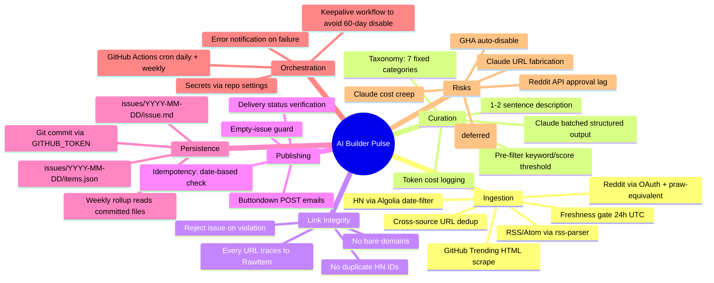

# AI Builder Pulse — Phase 1 Discovery Brief

**Prepared:** 2026-04-18
**Inputs:** `.planning/PROJECT.md`, `.planning/REQUIREMENTS.md`, `.planning/ROADMAP.md`, `.planning/research/*` (STACK, FEATURES, ARCHITECTURE, PITFALLS, SUMMARY), `.planning/phases/01-foundation/01-CONTEXT.md`
**Scope confirmed:** Full v1 per ROADMAP (all 5 phases), TypeScript + Node, DDD-shaped epics, launch infinity loop after Gate 3.

## Research Sufficiency Gate — Evidence

Search of `ca search` memory returned no prior lessons (greenfield). Domain familiarity comes from five dense project-level research documents already on disk:

| Source | Relevance | Why it counts |
|---|---|---|
| `.planning/research/ARCHITECTURE.md` | HIGH | Full linear-pipeline diagram + component contracts + data flow |
| `.planning/research/STACK.md` | HIGH | Tech choices and version pins (note: TypeScript decision overrides Python recommendations) |
| `.planning/research/PITFALLS.md` | HIGH | GitHub Actions gotchas, Claude fabrication, idempotency, Reddit approval |
| `.planning/research/FEATURES.md` | HIGH | Feature inventory mapped to v1/v2 |
| `.planning/phases/01-foundation/01-CONTEXT.md` | MEDIUM | TypeScript decision + repo-layout constraints |

**Decision:** ≥5 relevant sources. Threshold passed. No `/compound:get-a-phd` trigger.

## Ubiquitous Language (Domain Glossary)

| Term | Meaning in this system |
|---|---|
| **RawItem** | A normalized struct emitted by any collector — `{id, source, title, url, score, publishedAt, metadata}`. Sole schema crossing the collector boundary. |
| **ScoredItem** | RawItem enriched by Claude with `{category, relevanceScore, keep, description}`. Sole schema crossing the curation boundary. |
| **DailyIssue** | The rendered deliverable — a markdown body, a subject line, and the ScoredItems backing it. Committed to git and sent to Buttondown. |
| **Source** | One ingestion origin (HN, GitHub Trending, Reddit, RSS). One collector module per source. |
| **Collector** | A function `fetch(): Promise<RawItem[]>` that talks to exactly one source's API/feed. |
| **Pre-filter** | Deterministic stage: freshness (≤24h), URL shape validation, cross-source URL dedup. No AI. |
| **Curator** | The Claude-backed stage: single batched `messages.create` with structured output, returns scored JSON keyed to input order. |
| **Link integrity** | Invariant: every URL in the rendered issue must also appear verbatim in the input RawItem set. Violation = reject the issue. |
| **Provenance check** | Post-generation validation that enforces Link integrity. |
| **Publisher** | Buttondown REST adapter — `POST /v1/emails` with idempotency guard (skip if an email for today's date already exists). |
| **Archivist** | Git-persistence side-effect — writes `issues/YYYY-MM-DD/{issue.md, items.json}` and commits via `GITHUB_TOKEN`. |
| **Weekly digest** | Rollup that reads the last 7 `items.json` files and re-ranks cross-day. Separate workflow from daily. |
| **Scheduler** | GitHub Actions cron — orchestrates the daily run and weekly run; must stay un-disabled via keepalive. |
| **Freshness window** | 24 hours, computed as `now - 24h` in UTC at run time. |
| **Empty-issue guard** | Skip publishing when ScoredItem count after curation is below threshold. |

## Discovery Mindmap

## Reversibility Analysis (spend effort proportional to irreversibility)

| Decision | Class | Why |
|---|---|---|
| Buttondown as publish target | **Irreversible-ish** | Subscriber list lives there; migration needs export/import. Drives Publisher interface shape. |
| GitHub Actions as runtime | **Moderate** | Could port to Cloud Scheduler or Railway later; cron shape similar. |
| Git-as-persistence file layout (`issues/YYYY-MM-DD/`) | **Irreversible** | Becomes the Weekly Digest contract; renaming path breaks history. |
| Pydantic/Zod boundary schemas (RawItem, ScoredItem) | **Moderate** | Adding fields is cheap; renaming/removing propagates everywhere. |
| Fixed 7-category taxonomy | **Moderate** | Category name in committed JSON; change requires migration. |
| Single-batch Claude call | **Reversible** | Pure implementation — swap for Message Batches API later. |
| TypeScript + Node | **Moderate** | Language rewrite is painful but not customer-visible. |
| HN Algolia vs Firebase | **Reversible** | Internal to HN collector; swap behind Collector interface. |
| Cron schedule (06:07 UTC) | **Reversible** | One YAML line. |
| Dependency on `rss-parser`, `@anthropic-ai/sdk` | **Reversible** | Library-layer choices. |

## Change Volatility

| Boundary | Volatility | Implication |
|---|---|---|
| Collector adapters (one per source) | **HIGH** | Source APIs break often; treat each as an isolated module behind the Collector interface. Strong modularity investment justified. |
| Pre-filter rules | **HIGH** | Tuning keyword/score thresholds is an ongoing craft; isolate config. |
| Claude prompt + taxonomy | **HIGH** | Prompt engineering is iterative; prompt as a versioned artifact (not a string literal scattered in code). |
| Models (RawItem / ScoredItem) | **LOW** | Schema is load-bearing; keep stable, additive evolution only. |
| Publisher (Buttondown) | **LOW** | API is stable, one endpoint. |
| Persistence file layout | **LOW** | Contract for Weekly Digest; changing it breaks archived readers. |
| Scheduler YAML | **MODERATE** | Changes for cron timing, matrix runs, keepalive cadence. |

**Modularity investment rule:** the high-volatility boundaries (collectors, pre-filter rules, prompt) deserve distinct epics with well-defined contracts. Low-volatility boundaries (models, persistence layout, publisher) stay thin and shared.

## Design Skill Detection (for Phase 2 spec)

- **User-visible surface:** the rendered markdown email, fully templated by Buttondown's default reader experience.
- **No custom UI, dashboard, landing page, or API surface.** All reader polish is delegated to Buttondown.
- **Software design philosophy concerns still apply** (deep modules, information hiding, complexity management — Ousterhout) because the pipeline has five cross-epic contracts.
- **Decision:** Do **not** invoke `/compound:build-great-things` for user-visible design. **Do** record a spec note asking each implementing epic to hold the line on clean interfaces and small, deep modules. No full build-sequence needed.

## Assumptions That Must Hold for Decomposition to Remain Valid

1. **Each source's API remains accessible without browser automation.** Twitter/X already invalidated this in one direction; treated as deferred.
2. **Claude structured output is reliable enough** that schema-validated responses rarely require retry. Tenacity retry wraps this with ≤3 attempts.
3. **GitHub Actions free-tier minutes stay within budget** (~5-10 min/day daily + ~2 min/week weekly + keepalive).
4. **Buttondown API remains stable** and supports `status: "about_to_send"` or `scheduled`.
5. **Reddit app approval arrives before Reddit collector is needed** — if not, public `.json` endpoints are the fallback.
6. **Git repo size stays trivial** (100KB/day × 365 < 40MB/yr). No archival strategy needed for years.
7. **No requirement for real-time personalization, analytics, or subscriber-targeted content in v1.**

If any of #1, #3, or #4 turns out false, the bounded-context shape still holds but the Orchestration epic and Publisher epic absorb the blast radius.

---
*Next: Phase 2 produces the system-level EARS spec, architecture diagrams, and scenario table at `docs/specs/ai-builder-pulse.md`.*
