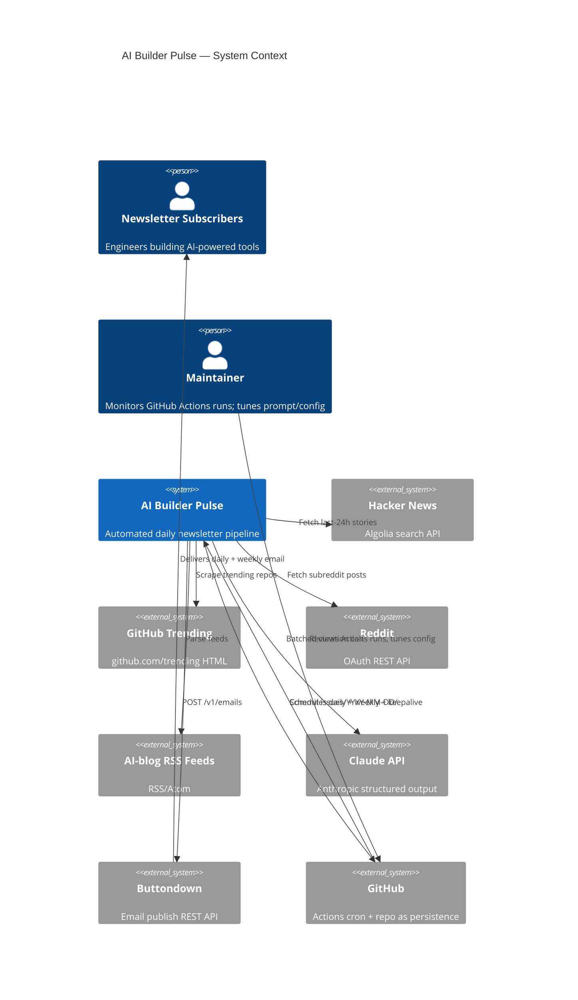
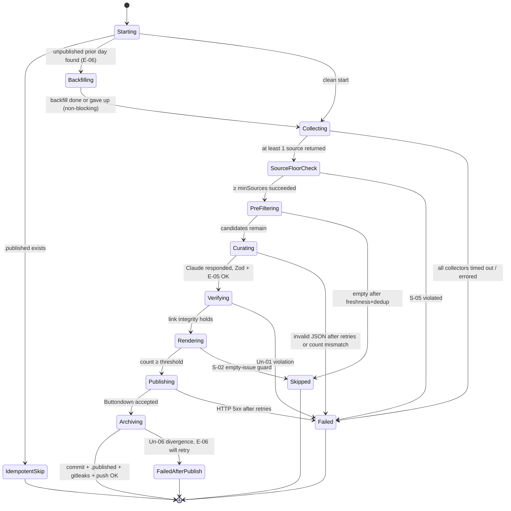

# AI Builder Pulse — System Specification

**Status:** Gate-2-approved (revisions R1–R14 applied)
**Prepared:** 2026-04-18 · Revised post-advisory-fleet: 2026-04-18
**Phase-1 brief:** `docs/specs/ai-builder-pulse-phase1-discovery.md`
**Advisory brief:** `docs/specs/ai-builder-pulse-advisory-brief.md`
**Planning inputs:** `.planning/PROJECT.md`, `.planning/REQUIREMENTS.md`, `.planning/ROADMAP.md`, `.planning/research/*`
**Delivery profile (advisory):** `service` — scheduled batch pipeline with no synchronous user-facing API surface. Publisher side-effect talks to Buttondown. No web UI.

---

## 1. System Intent

A fully automated daily newsletter pipeline that each day (1) ingests fresh candidate items from HN, GitHub Trending, Reddit, and AI-blog RSS feeds, (2) pre-filters them deterministically, (3) curates them via a batched Claude API call with structured output, (4) enforces that every output URL traces verbatim to a source item, (5) renders the result as a markdown daily issue, (6) commits the issue + items JSON to the git repo, and (7) publishes to Buttondown — with idempotency, empty-issue, freshness, and minimum-source-diversity guards, running under GitHub Actions cron with no human intervention. A secondary weekly workflow rolls up the last N committed issues into a best-of digest.

**Core trust contract:** no URL may reach a subscriber that was not present in the ingested raw-item set. Claude is classifier and writer, not source of truth for links.

**Intentionally linear.** The pipeline is a linear function-call chain. Epic boundaries reflect test isolation and development parallelism, not runtime service boundaries. The target state is one Orchestrator calling module-level functions.

---

## 2. System-Level EARS Requirements

Patterns: **U**biquitous / **E**vent / **S**tate / **Un**wanted / **O**ptional.

### 2.1 Ubiquitous

- **U-01** The system SHALL represent every ingested item as a `RawItem` with `{id, source, title, url, sourceUrl?, score, publishedAt, metadata}`. `metadata` SHALL be a closed Zod schema with per-source named fields — `Record<string, unknown>` is prohibited. `url` stores the canonical URL after ≤3 redirect hops; `sourceUrl` stores the original pre-redirect URL when the two differ.
- **U-02** The system SHALL represent every curated item as a `ScoredItem` extending `RawItem` with `{category, relevanceScore, keep, description}`. Claude SHALL return exactly one ScoredItem per RawItem submitted to it, in any order.
- **U-03** The system SHALL enforce a 24-hour freshness window on every item before curation, computed as `runDate - 24h` in UTC.
- **U-04** The system SHALL compute a normalized URL (strip UTM params, normalize trailing slash, lowercase host, canonical post-redirect) as the dedup key across sources.
- **U-05** The system SHALL categorize every accepted ScoredItem into exactly one of the seven fixed categories: `Tools & Launches`, `Model Releases`, `Techniques & Patterns`, `Infrastructure & Deployment`, `Notable Discussions`, `Think Pieces & Analysis`, `News in Brief`.
- **U-06** The system SHALL persist every daily issue as `issues/YYYY-MM-DD/issue.md`, `issues/YYYY-MM-DD/items.json`, and (after successful publish) `issues/YYYY-MM-DD/.published` — all committed to the repo.
- **U-07** The system SHALL load all secrets (Anthropic, Buttondown, Reddit, GitHub token) from GitHub Actions secrets and never log their values.
- **U-08** The system SHALL use TypeScript strict mode and validate all inter-stage data with Zod schemas.
- **U-09** The Orchestrator SHALL derive an immutable `runDate: YYYY-MM-DD` (UTC) at process startup and pass it as context to every stage. The archive path, freshness window, and publish sentinel all use this same `runDate`.
- **U-10** The system SHALL record a `sourceSummary` in committed `items.json` listing per-source counts and success/failure status for the run.
- **U-11** The system SHALL document a data retention policy (v1 default: unbounded in-repo; revisit when `issues/` exceeds 100 MB or ≥5 years, whichever first).

### 2.2 Event-driven

- **E-01** WHEN the daily cron fires, the system SHALL execute the full daily pipeline (collect → prefilter → curate → verify → render → persist → publish).
- **E-02** WHEN the weekly cron fires, the system SHALL read the last seven `issues/YYYY-MM-DD/items.json` files that exist, re-rank items cross-day, and publish a weekly digest. If fewer than seven exist, the digest SHALL proceed with what is available and annotate the missing days in the body.
- **E-03** WHEN the keepalive cron fires, the system SHALL perform a trivial no-op commit or workflow run sufficient to prevent GitHub Actions 60-day auto-disable.
- **E-04** WHEN any pipeline stage throws an unrecoverable error, the system SHALL emit a `::error::` annotation, exit the workflow with non-zero status, and surface failure via GitHub Actions' built-in email notification.
- **E-05** WHEN Claude returns an item count ≠ the count of RawItems submitted to it, the system SHALL reject the curation output and fail the run. Invariant: `scoredItems.length === rawItemsSentToClaude.length`.
- **E-06** WHEN the Orchestrator starts, it SHALL scan `issues/` for any `YYYY-MM-DD/` directory containing `issue.md` but not `.published`, emit a warning, and attempt backfill (re-publish + write `.published`) before processing `runDate`. A failed backfill is loud but non-blocking for the current run.

### 2.3 State-driven

- **S-01** WHILE an item's `publishedAt` is older than `runDate - 24h`, the system SHALL exclude it from downstream stages.
- **S-02** WHILE the curated ScoredItem count is below `minItemsToPublish`, the system SHALL skip the Buttondown publish call, skip writing `.published`, and exit 0 with a recorded skip reason.
- **S-03** WHILE `issues/{runDate}/.published` already exists at Orchestrator startup, the system SHALL skip publishing and treat the run as idempotently complete. Buttondown is NOT queried for idempotency.
- **S-04** WHILE Reddit app approval is pending (external dependency), the system SHALL either skip the Reddit collector with a warning or fall back to the public `.json` endpoint, configurable via env.
- **S-05** WHILE fewer than `minSources` (default 2) collectors return items, the system SHALL treat the run as E-04 and skip publishing, rather than emit a thin single-source issue.

### 2.4 Unwanted-behavior

- **Un-01** IF any URL extracted from a `ScoredItem.url` field or from Markdown links inside `ScoredItem.description` is not present verbatim in the input RawItem URL set (including `sourceUrl` aliases), THEN the system SHALL fail the run before publishing. Template-static URLs (unsubscribe footer, newsletter site, Buttondown-hosted archive) are governed by a named Renderer allowlist and are NOT subject to this check.
- **Un-02** IF a URL in input data is a bare domain (no path, no query), a GitHub user-profile page, or fails scheme validation, THEN the system SHALL drop that RawItem before curation.
- **Un-03** IF two RawItems share the same normalized URL, THEN the system SHALL keep only the highest-score / most-authoritative source and drop the rest.
- **Un-04** IF any secret appears in stdout, stderr, or a committed file, THEN the system SHALL fail the run.
- **Un-05** IF Claude returns structurally invalid JSON or a ScoredItem fails Zod validation after retries, THEN the system SHALL fail the run and not publish a partial issue.
- **Un-06** IF the git commit step fails after a successful Buttondown publish, THEN the system SHALL emit a loud `::error::` divergence alert AND ensure `.published` is written on the next successful run (see E-06).
- **Un-07** Un-04 detection is automated: the workflow YAML SHALL include a `gitleaks` (or `trufflehog`) scan step between Archivist and `git push`. A positive scan fails the run.

### 2.5 Optional / Feature-flagged

- **O-01** WHERE the Twitter/X collector is enabled via env flag (v2), the system SHALL include X items; otherwise the collector SHALL be a no-op with a recorded skip.
- **O-02** WHERE `DRY_RUN=1`, the system SHALL run the full pipeline up to but not including the Buttondown POST, the git commit, and the `.published` write. DRY_RUN bypasses the S-03 idempotency check; log `[DRY_RUN] would publish …`.
- **O-03** WHERE prompt-cache hit is available, the system SHOULD use it to reduce Claude cost on stable system prompts.
- **O-04** **v1 uses synchronous `messages.create` only.** The Message Batches API (24-hour SLA) is explicitly deferred to v2 and will require re-architecting the Orchestrator into a two-phase (submit → later fetch-and-publish) design. Not a drop-in substitute.
- **O-05** WHERE pre-filtered items exceed `CURATOR_CHUNK_THRESHOLD` (default 50), the Curator SHALL chunk into parallel synchronous calls of ≤50 items each and merge results by RawItem id. Schema and invariants (E-05) unchanged.
- **O-06** Collectors SHALL follow ≤3 redirect hops when constructing a RawItem. The final URL is stored as `url`; the pre-redirect URL is stored as `sourceUrl` when it differs.

---

## 3. Architecture Diagrams

### 3.1 C4 Context



### 3.2 Sequence — Daily Run

```mermaid
sequenceDiagram
  autonumber
  participant Cron as GitHub Actions Cron
  participant Orch as Orchestrator (runDate)
  participant Col as Collectors
  participant Pre as Pre-filter
  participant Cur as Curator (Claude)
  participant Lnk as Link-integrity
  participant Ren as Renderer
  participant Arc as Archivist (git)
  participant Pub as Publisher (Buttondown)

  Cron->>Orch: fire daily @ 06:07 UTC
  Orch->>Orch: derive runDate (UTC); backfill any unpublished days (E-06)
  alt .published for runDate already exists
    Orch-->>Cron: S-03 idempotent skip, exit 0
  else
    Orch->>Col: fetchAll(runDate, perCollectorTimeout=60s)
    Col-->>Orch: RawItem[] per source (partial OK)
    Orch->>Orch: S-05 check — minSources≥2 ?
    Orch->>Pre: freshness + URL shape + dedup
    Pre-->>Orch: RawItem[] (filtered)
    Orch->>Cur: chunk-if-needed + batched messages.create
    Cur-->>Orch: ScoredItem[] (Zod-validated, count-invariant enforced)
    Orch->>Lnk: verify ScoredItem urls ∈ raw url set (sourceUrl aliases OK)
    alt Link integrity OK & count ≥ threshold
      Orch->>Ren: render markdown (with template allowlist)
      Ren-->>Orch: {subject, body}
      Orch->>Pub: POST /v1/emails
      Pub-->>Orch: accepted
      Orch->>Arc: write issue.md + items.json + .published, commit, gitleaks scan, push
    else Link integrity fail / count below threshold / S-05 floor
      Orch-->>Cron: ::error:: or skip-publish with reason
    end
  end
```

### 3.3 State — Daily Run Lifecycle



---

## 4. Scenario Table

| # | Scenario | EARS ref | Expected outcome |
|---|---|---|---|
| 1 | Nominal daily run with ~400 HN + 30 trending + 50 Reddit + 20 RSS items | E-01, U-* | ~25-40 ScoredItems published to Buttondown, committed with `.published` |
| 2 | All sources return empty | E-01, S-02 | Empty-issue guard triggers, skip publish, exit 0 |
| 3 | Only 1 source returns items | S-05 | Treated as E-04; no thin issue published |
| 4 | Claude returns item count ≠ input count | E-05, Un-05 | Reject curation, fail run before publish |
| 5 | Claude emits a URL not in input RawItems | Un-01 | Link-integrity reject, fail run before publish |
| 6 | A RawItem's URL is a bare domain | Un-02 | Dropped before curation |
| 7 | Two sources surface the same article | U-04, Un-03 | Normalized-URL dedup keeps one |
| 8 | Item older than 24h slips through collector | U-03, S-01 | Freshness gate drops it |
| 9 | Cron fires twice same date (already published) | S-03 | Local `.published` detected, idempotent skip |
| 10 | Weekly cron fires Monday | E-02 | Reads available items.json files (may be <7), publishes digest |
| 11 | Keepalive cron fires weekly | E-03 | No-op run prevents 60-day disable |
| 12 | Buttondown returns 5xx | tenacity, E-04 | Retries with backoff; fail run if still failing |
| 13 | Git commit fails after publish succeeds | Un-06, E-06 | Loud error this run; next run detects missing `.published` and backfills |
| 14 | Reddit credentials missing | S-04 | Collector skipped with warning; S-05 still evaluated |
| 15 | Twitter/X flag enabled in v2 | O-01 | Twitter collector runs; otherwise no-op |
| 16 | `DRY_RUN=1` | O-02 | Pipeline runs to renderer; no POST, no commit, no `.published`; S-03 bypassed |
| 17 | Secret leaks into a log line or commit | Un-04, Un-07 | gitleaks scan catches it and fails run before push |
| 18 | Pre-filtered count = 180 (>threshold) | O-05 | Curator chunks into 4 parallel calls, merges by id |
| 19 | Collector returns a tracking redirect URL | O-06 | Collector resolves ≤3 hops, stores canonical as `url`, original as `sourceUrl` |
| 20 | Long-running collector exceeds its 60s timeout | C1 | Collector timed out, run continues with remaining sources if S-05 floor satisfied |

---

## 5. Design Note

- **No custom UI** — reader experience is Buttondown's default markdown rendering. `/compound:build-great-things` is **not** required.
- **Software design philosophy applies.** Epics should hold the line on deep modules, narrow interfaces, and information hiding (Ousterhout). The pipeline has ~6 meaningful cross-epic contracts and keeping them clean is the main architectural task.
- **Prompt as artifact.** The curation prompt and taxonomy definitions live in a versioned file (`src/curator/prompt.ts` with a stable `SYSTEM_PROMPT` constant) — diffable, reviewable, rollbackable.

---

## 6. Cross-Epic Contract Inventory (inputs to Phase 3)

| Contract | Producer | Consumers | Type | Volatility | Notes |
|---|---|---|---|---|---|
| **C1 Collector** | Each source collector | Orchestrator | Behavioral | HIGH | `fetch(ctx: {runDate, abortSignal}): Promise<RawItem[]>`; each collector MUST enforce a configurable timeout (default 60 s); Orchestrator proceeds with partial results if ≥`minSources` collectors return. |
| **C2 RawItem schema** | Collectors | Pre-filter, Curator | Data | LOW | Zod schema with closed `metadata` per source. Additive evolution only. |
| **C3 ScoredItem schema** | Curator | Renderer, Archivist, Link-integrity | Data | LOW | Zod schema. Count-invariant tied to Curator output (E-05). |
| **C4 Link-integrity predicate** | Link-integrity module | Orchestrator (gate) | Behavioral | LOW | Pure function `verifyLinkIntegrity(scored, raw): Result`; scoped per Un-01. |
| **C5 Rendered markdown** | Renderer | Publisher, Archivist | Data | LOW | `{subject, body}`. Renderer owns the template-URL allowlist. |
| **C6 Archive path convention** | Archivist | Weekly Rollup (v1.x) | Data | MODERATE | `issues/YYYY-MM-DD/{issue.md, items.json, .published}`. Chosen for simplicity; Weekly Digest consumes it but does not freeze the layout — a rolling-archive migration is permitted if U-11 retention policy triggers. |
| **C7 Publish sentinel (local file)** | Archivist (writes) / Orchestrator (reads at startup) | Orchestrator | Data | LOW | `issues/{runDate}/.published` exists iff Buttondown publish succeeded. Replaces any Buttondown LIST-based idempotency check. |
| **C8 Cron entry + runDate** | Scheduler (workflow YAML) | Orchestrator | Behavioral | LOW | Env-vars + CLI args; Orchestrator derives immutable `runDate: YYYY-MM-DD` (UTC) at startup and threads it to every stage. |

**Classification summary:** 0 Composition, 3 Behavioral (C1, C4, C8), 5 Data (C2, C3, C5, C6, C7).
**Integration Verification scope level → MEDIUM** (behavioral contracts + one data contract with a lifecycle dimension, C7). No composition contracts remain after R1.

---

## 7. Assumptions (carry-forward, updated)

1. Each source API stays accessible without browser automation.
2. Claude structured output is reliable enough that schema-validated responses rarely retry > 3×.
3. GitHub Actions free-tier minutes stay within budget.
4. Buttondown API remains stable and supports `status: "about_to_send"` or `scheduled`.
5. Reddit app approval arrives before the Reddit collector is required, or the public `.json` endpoint remains open.
6. Git repo size stays trivial for v1 scope; revisit retention when `issues/` exceeds 100 MB or at 5 years (U-11).
7. No real-time personalization, per-subscriber targeting, or analytics in v1.
8. Synchronous `messages.create` stays within GHA step time (<10 min) for pre-filtered item counts ≤300, even with chunked curation (O-05).

---

## 8. Epic Decomposition Target (input to Phase 3)

Phase 3 subagents SHALL propose bounded contexts consistent with this target shape (6-7 epics + IV):

1. **Foundation & Orchestration** — TS scaffold, Zod models, Orchestrator entry point with `runDate` derivation, GHA workflows (daily + weekly + keepalive), secrets config, E-06 backfill logic, **Mock Curator** pass-through for end-to-end smoke tests before real Claude integration.
2. **Ingestion** — All four source collectors (HN, GitHub Trending, Reddit, RSS), the C1 interface, per-collector timeout, redirect-hop resolution (O-06), Twitter/X stubbed behind O-01.
3. **Pre-filter** (or fold into Ingestion if cognitive-load analysis prefers) — freshness gate, URL-shape validation, normalized-URL dedup, source-floor check.
4. **Curation & Link-integrity** — Claude `messages.create` with structured output, chunk-merge (O-05), E-05 count invariant, Zod ScoredItem validation, token cost logging, link-integrity predicate (C4 lives here as a post-call verification step).
5. **Rendering & Publishing** — Markdown renderer with template-URL allowlist, Buttondown adapter, empty-issue guard (S-02), DRY_RUN support (O-02).
6. **Persistence & Weekly Digest** — Archivist (commit `issue.md`, `items.json`, `.published`, gitleaks step, push), weekly rollup (E-02) tolerant to missing days, U-11 retention-policy documentation.
7. **Integration Verification** — cross-epic contract tests, full E2E fixture run, failure-injection scenarios per Table 4. Scope level **MEDIUM** (behavioral + lifecycle contracts).

Phase 3 may merge/split these based on its multi-criteria validation (structural / semantic / organizational / economic). The target count is 6-7 + IV.

---

## 9. Meta-Epic Reference

A meta-epic `epic: AI Builder Pulse v1 (system)` will be created in Phase 4 and will hold this spec path, the dependency graph, and the processing order for the materialized epics.

*Next: Phase 3 — 6 parallel subagent decomposition, then Gate 3.*
