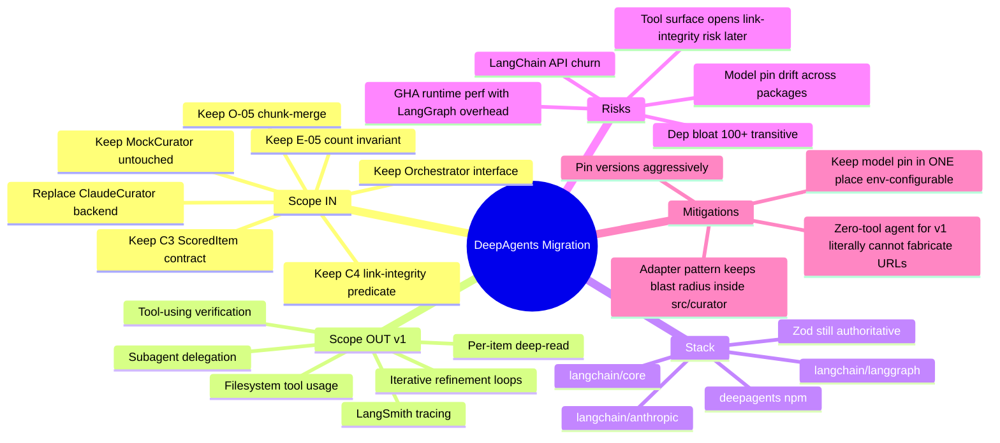

# DeepAgents Migration — Phase 1 Discovery

**Prepared:** 2026-04-18
**Scope:** Replace `src/curator/claudeCurator.ts`'s direct `@anthropic-ai/sdk` call with a DeepAgents-backed curator. Same contracts (C3 ScoredItem schema, C4 link-integrity, E-05 count invariant, O-05 chunk-merge). Same Orchestrator interface. Mock curator untouched.
**Explicit driver:** Forward-investment in agent substrate for future tool-using capabilities. Spec-level simplicity argument intentionally overridden.

## Research Sufficiency — Evidence (gate passes)

| Source | Relevance | Why |
|---|---|---|
| `docs.langchain.com/oss/javascript/deepagents/overview` | HIGH | Official DeepAgents JS reference docs |
| `github.com/langchain-ai/deepagentsjs` | HIGH | First-party JS implementation, actively maintained (9.9k stars March 2026) |
| `npmjs.com/package/deepagents` | HIGH | Current npm package; `pnpm add deepagents` |
| `@langchain/langgraph` npm + 1.0 changelog | HIGH | Execution engine; Zod + Standard-JSON-Schema support |
| `@langchain/anthropic` | HIGH | Anthropic provider binding with structured-output `providerStrategy` |

**Decision:** 5 highly-relevant first-party sources. Research sufficient. No `/compound:get-a-phd`.

## Ubiquitous Language (new terms layered over base system)

| Term | Meaning in this migration |
|---|---|
| **DeepAgent** | A LangGraph-compiled agent harness (planner loop + filesystem tool + optional subagent-spawn + optional tool set). From the `deepagents` package. Replaces our direct `messages.create` call. |
| **Planner tool** | Built-in `write_todos` inside DeepAgents. Agent decomposes a task into todos and works them. For curation, effectively a no-op; still runs but produces a trivial plan. |
| **Subagent** | A child agent spawned by the main DeepAgent. NOT USED in v1 of this migration. Reserved for "deep-read" follow-up epic. |
| **Tool surface** | The set of callable tools registered with the agent. **v1 migration ships with NO custom tools** — DeepAgents' built-ins (filesystem, planner) come along for free but are unused in the curation flow. |
| **Graph** | LangGraph runtime artifact: a compiled state machine. DeepAgents constructs one; we invoke it once per curation chunk. |
| **Provider strategy** | LangChain's approach to enforcing structured output per-provider. For Anthropic, translates to the structured-outputs API. Binds our Zod `ScoredItemArraySchema` directly. |
| **Thread / checkpoint** | LangGraph persistence primitive. Unused in this migration (single-shot runs, no resumption). |

## Discovery Mindmap

## Reversibility Analysis

| Decision | Class | Rationale |
|---|---|---|
| Swap `ClaudeCurator` backend | **Reversible** | Pure implementation; C3/C4/E-05 contracts unchanged. Can revert to direct SDK with `git revert`. |
| Add 4 npm deps (`deepagents`, `@langchain/langgraph`, `@langchain/anthropic`, `@langchain/core`) | **Moderate** | Dep count grows ~100 transitive. Revert requires `pnpm remove` + code revert. Low surprise. |
| Model pin moves from `src/curator/prompt.ts` constant to a LangChain binding | **Moderate** | Need a single source of truth; test `modelPin.test.ts` must be updated. |
| Shape of our Curator internals: node-graph vs function | **Reversible** | Internal to `src/curator/`; Orchestrator doesn't see it. |
| Anthropic structured output via `providerStrategy` | **Reversible** | Under the hood of `@langchain/anthropic`; we still submit Zod schemas. |

## Change Volatility

| Boundary | Volatility | Implication |
|---|---|---|
| `deepagents` package API | **HIGH** | Fast-moving. Pin exact version; add a thin adapter layer (`src/curator/deepagent/adapter.ts`) so a breaking change never reaches Orchestrator. |
| `@langchain/langgraph` API (1.0 just landed) | **HIGH** | Same treatment. Wrap its `compile()` / `invoke()` calls inside adapter. |
| `@langchain/anthropic` provider strategy | **MODERATE** | Stabilizing but pre-1.0 in places. |
| Zod schemas (C2 RawItem, C3 ScoredItem) | **LOW** | Unchanged. |
| Orchestrator → Curator call signature | **LOW** | `runCurator(rawItems, ctx): Promise<ScoredItem[]>` stays identical. |
| Model identifier (`claude-sonnet-4-6`) | **LOW** | One config point; already has `modelPin.test.ts` consistency test. |

## Key Concerns to Address in Phase 2 Spec

1. **Tool surface is literally empty for v1.** The DeepAgent planner runs, but there are no custom tools registered. That preserves the link-integrity invariant (Claude with no tool access cannot introduce URLs from outside the input set). This is the narrowest "real" DeepAgents migration that still buys the substrate.

2. **C4 link-integrity predicate survives unchanged.** It already operates on structured output URLs vs raw input URLs — agnostic to whether the output came from `messages.create` or from a DeepAgent graph. Hardening for future tool-use is a followup epic, not a v1 concern.

3. **Model pin single source of truth.** Currently lives in `src/curator/prompt.ts` as a constant. After migration, the same constant must flow into `@langchain/anthropic`'s model binding. `tests/consistency/modelPin.test.ts` needs updating to follow.

4. **Chunk-merge (O-05) stays at the adapter layer.** DeepAgents operates on a single task at a time. Our chunker lives around the DeepAgent invocation, not inside the graph. This preserves the existing E-05 count-invariant enforcement code unchanged.

5. **Deadletter handling (`src/curator/deadletter.ts`) stays unchanged.** It wraps the adapter.

6. **Runtime cost:** LangGraph execution adds minor overhead per run (graph compile, state management). Negligible for daily batch of ≤300 items; may matter at 10× scale. Not a v1 concern.

7. **Dev-ex:** `deepagents` uses Claude sonnet-4-5 as its default. We override to `claude-sonnet-4-6` per our model pin.

## Assumptions That Must Hold

1. `deepagents` JS package works with Node 20+ and ESM out of the box (first-party docs say yes; Phase 2 verifies).
2. `@langchain/langgraph` accepts Zod schemas directly for structured output (confirmed in changelog).
3. Anthropic model availability + API keys unchanged (uses same `ANTHROPIC_API_KEY`).
4. GHA `ubuntu-latest` install path is clean for `pnpm add deepagents @langchain/langgraph @langchain/anthropic @langchain/core` (Phase 2 verifies — transient network issues aside, this is stock npm/pnpm).
5. No LangSmith traces or external observability required for v1 (can be added later behind a flag).
6. Existing tests can be adapted mechanically: mock the LangGraph invocation, not the SDK.

If assumption #2 proves false (Zod not natively supported) we fall back to LangChain's `z.toJSONSchema` adapter — low risk.

## Design Skill Detection

- No UI. No reader-facing artifact changes. Curator output is still markdown ultimately, but this migration doesn't touch rendering.
- **`/compound:build-great-things` not required.**
- Software design philosophy (Ousterhout deep modules) applies: the DeepAgent adapter should be a deep module — narrow interface (`curate(items, ctx) → ScoredItem[]`), thick implementation (graph construction, schema binding, chunking, invocation, error mapping).

---
*Next: Phase 2 spec with EARS + architecture diagrams + advisory fleet + Gate 2.*
